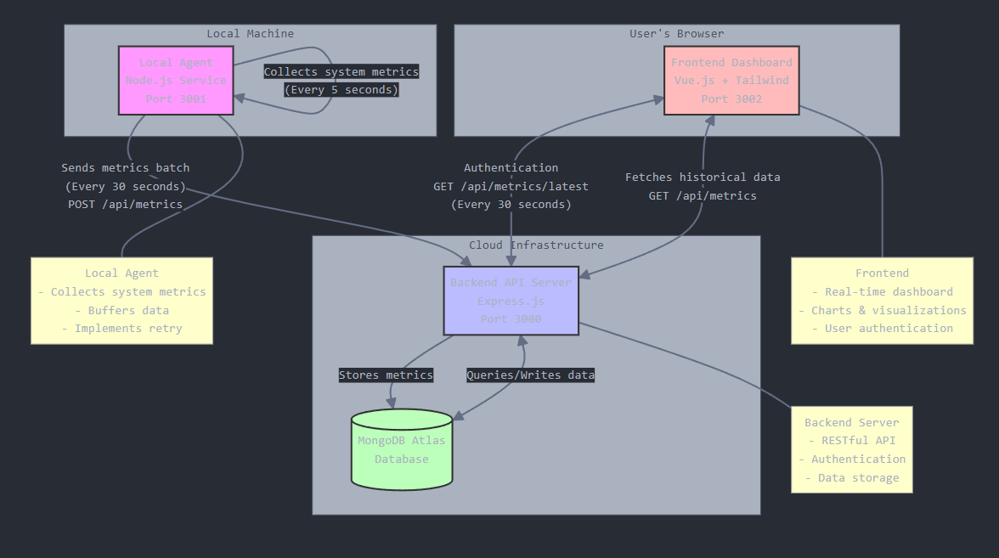

# Incredibuild Home Task

App (Front + Back) written in Nuxt.js.

agent as a node file


## Setup

Make sure to install dependencies:

```bash
# npm
npm install

```

### Please Provide a MongoDB endpoint in .env.local in placeholder


MONGODB_URI={placeholder}

this is since my private mongo cluster is nearly over quota.

took around 3.5 hours, I skipped authentication.

did not put much effort on UX, but I did provide mobile support.

## Development Server

Start the development server on `http://localhost:3000`:

```bash
# npm
npm start
```


